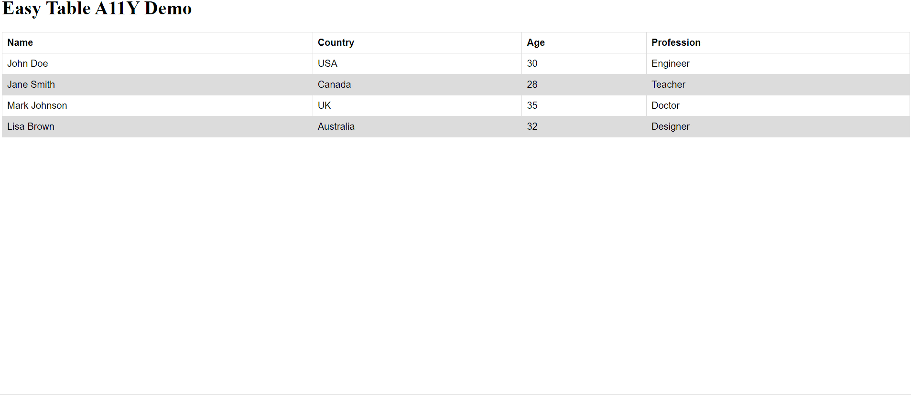

# EasyTable

A Simple Responsive Table js library.

## Install

### Download

- [easy-table.min.js](https://unpkg.com/@sachinkiranti/easy-table-a11y@1.0.2/dist/easy-table.min.js)

### CDN

Link directly to EasyTable files on [unpkg](https://unpkg.com).


``` html
<script src="https://unpkg.com/@sachinkiranti/easy-table-a11y@1.0.2/dist/easy-table.min.js"></script>
```

## Usage

```html
    <table>
      <thead>
        <tr>
          <th>Name</th>
          <th>Country</th>
          <th>Age</th>
          <th>Profession</th>
        </tr>
      </thead>
      <tbody>
        <tr>
          <td>John Doe</td>
          <td>USA</td>
          <td>30</td>
          <td>Engineer</td>
        </tr>
        <tr>
          <td>Jane Smith</td>
          <td>Canada</td>
          <td>28</td>
          <td>Teacher</td>
        </tr>
        <tr>
          <td>Mark Johnson</td>
          <td>UK</td>
          <td>35</td>
          <td>Doctor</td>
        </tr>
        <tr>
          <td>Lisa Brown</td>
          <td>Australia</td>
          <td>32</td>
          <td>Designer</td>
        </tr>
      </tbody>
    </table>

    <script src="https://cdnjs.cloudflare.com/ajax/libs/jquery/3.6.0/jquery.min.js" integrity="sha512-894YE6QWD5I59HgZOGReFYm4dnWc1Qt5NtvYSaNcOP+u1T9qYdvdihz0PPSiiqn/+/3e7Jo4EaG7TubfWGUrMQ==" crossorigin="anonymous" referrerpolicy="no-referrer"></script>
    <script src="https://unpkg.com/@sachinkiranti/easy-table-a11y@1.0.2/dist/easy-table.min.js"></script>

    <script>
        $(function () {
            $('table').easyTableA11y()
        });
    </script>
```

## Configurations

```js
$(function () {
  $('.table-1').easyTableA11y({
    label: 'data-easy-table',
    selector: '.table-1',
    view: '786px',
    css: {
      trBottomBorder: '1px solid #000',
      tdMarginRight: '10px !important',
      tdFontWeight: 'bold'
    }
  })
});
```

## Demo

You can see the demo page created in dist/demo.html.




## Development

This package is developed with Node.js v16.13.2 and npm v8.1.2

Install dependencies

``` sh
npm install
```

Run tests

``` sh
npm run test
```

## TODO
- [ ] Write tests
- [ ] More flexible configurations
